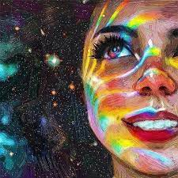
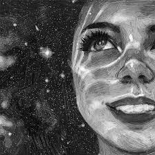

# 🖼️ Pixel-to-Text Compression Engine
### A custom-built image compression pipeline that turns pixels into text — without any external compression library.

**🇬🇧 English** · [🇹🇷 Türkçe oku](README.tr.md)

---

## 📌 What is this?

This project is an **experimental, from-scratch image compression algorithm** that converts a standard JPEG/PNG image into a plain **text file**, and then reconstructs a viewable image back from that text — all without relying on any existing image/compression libraries (no zlib, no PNG codecs, no off-the-shelf LZW packages)..

The goal was simple but ambitious: **can a pixel grid be represented as text, shrunk down close to the size of the original compressed image, and then rebuilt again?**

The answer turned out to be yes — through four progressively smarter encoding layers.

## 🧠 How it works (high level)

The pipeline is built in stages. Each stage takes the output of the previous one and squeezes it further.

| Stage | Technique | Idea |
|---|---|---|
| 1 | **Grid Averaging** | The image is split into a grid of blocks; each block is reduced to a single average grayscale value (0–255), turning the image into a matrix of numbers. |
| 1.5 | **Range Compression** | The 0–255 grayscale range is scaled down to 0–25, so every value fits in far fewer characters. |
| 2 | **Run-Length Encoding (custom)** | Repeated consecutive values (common in flat areas like sky or walls) are collapsed into `count + value` pairs. |
| 3 | **Alphanumeric Mapping** | The now-small 0–25 values are mapped onto single letters (`A`–`Z`), halving the character count again. |
| 4 | **Dictionary-based Compression (LZW-style)** | A Lempel-Ziv-Welch–inspired dictionary pass finds repeating patterns in the letter stream and re-encodes them as single Unicode symbols. |
| 5 | **Reconstruction** | The whole process runs in reverse: symbols → letters → run-lengths → grayscale grid → image, redrawn block by block onto a canvas. |

### 📉 Results

| Step | File Size |
|---|---|
| Original `.jpg` | **13 KB** |
| Stage 1 — raw grid values | 210 KB |
| Stage 1.5 — range-compressed | 118 KB |
| Stage 2 — run-length encoded | 99 KB |
| Stage 3 — alphanumeric mapped | 46 KB |
| Stage 4 — dictionary compressed | **~16 KB** 🚀 |

Starting from a 210 KB intermediate representation, the final pipeline lands within a few KB of the original JPEG — while going through a fully human-readable/text intermediate format at multiple points.

## 🖼️ Before & After

<table>
<tr>
<td align="center"><b>Original</b></td>
<td align="center"><b>Reconstructed from text-compressed data</b></td>
</tr>
<tr>
<td></td>
<td></td>
</tr>
</table>

The reconstructed image is grayscale and block-quantized by design — the point of the project isn't lossless fidelity, it's proving that a pixel grid can be pushed through a text-based pipeline and still come back recognizable.

## 📄 Full write-up

A detailed, step-by-step technical breakdown (with intermediate outputs, screenshots, and reasoning behind each optimization) is included as a PDF:

📎 [`docs/Pixel-Text-Compression-Whitepaper.pdf`](docs/Pixel-Text-Compression-Whitepaper.pdf)

## 💻 Code

This repo includes **illustrative, partial snippets** of each stage so you can follow the logic described above and in the whitepaper. They are simplified/redacted on purpose — this is a personal R&D project and the full, working implementation is kept private.

- [`src/01_grid_analysis.py`](src/01_grid_analysis.py) — block-averaging concept
- [`src/02_rle_pass.py`](src/02_rle_pass.py) — run-length pass concept
- [`src/03_alpha_mapping.py`](src/03_alpha_mapping.py) — number → letter mapping concept
- [`src/04_lzw_layer.py`](src/04_lzw_layer.py) — dictionary compression concept

## 🚧 Status

This is an active experiment, not a production compression library. Known limitations:

- Currently grayscale only (no color channel handling yet)
- Block quantization means detail loss is intentional and tunable via grid size
- Not benchmarked against standard codecs (JPEG/PNG/WebP) in a rigorous way — the 13 KB comparison is a single test image

## ⭐ If you find this interesting

This started as a personal curiosity project — if you like the idea, a star helps it reach more people and motivates further work on it (color support, adaptive grid sizing, better dictionary compression, etc).

## 📜 License

See [LICENSE](LICENSE).
